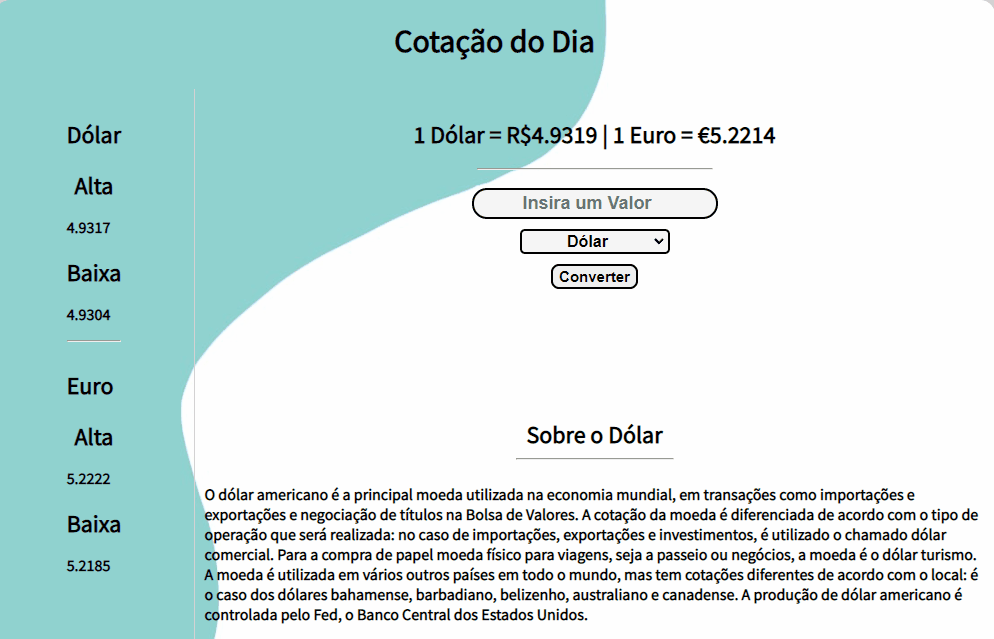

# Conversor de Moedas

<h2>Descrição 💲</h2>

Conversor de Moedas feito com HTML, CSS e Javascript.

Atualmente possui como opções apenas Dólar e Euro, mas futuramente serão adicionadas mais moedas.

<h2>Ilustrações</h2>

<h2>Funcionalidades</h2>

<ul>
    <li>Faz a conversão da moeda selecionada, sendo atualmente Dólar ou Euro.</li>
    <li>Mostra a Baixa e a Alta de ambas as moedas principais.</li>
</ul>

 

Feito com bastante ♥ por Lucas de Lima

Visite meu <a href="https://www.linkedin.com/in/lucas-lima-880aa1206/">Linkedin</a>

